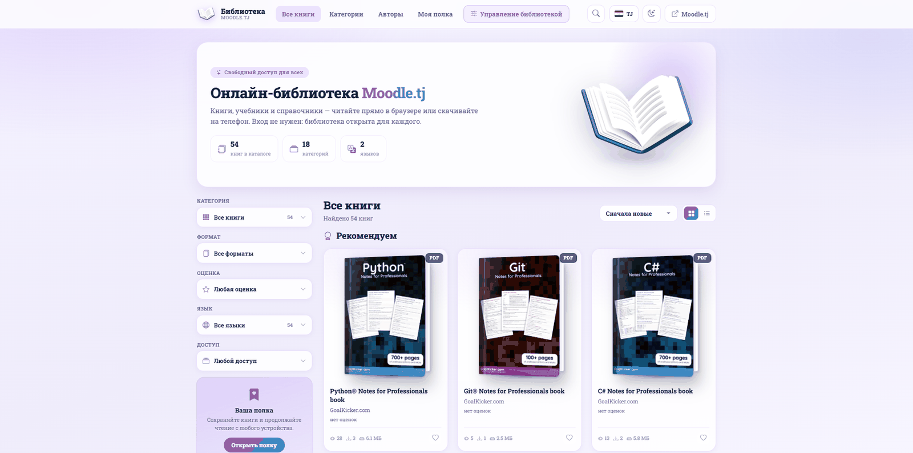
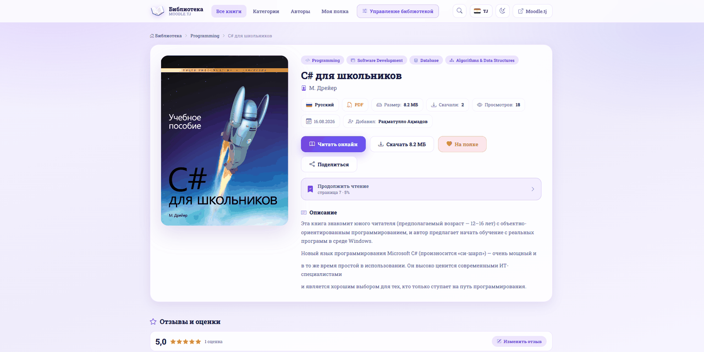
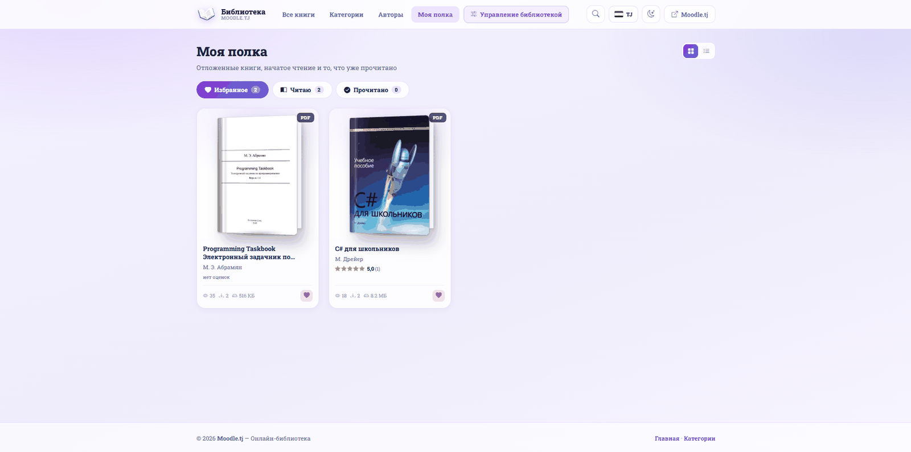
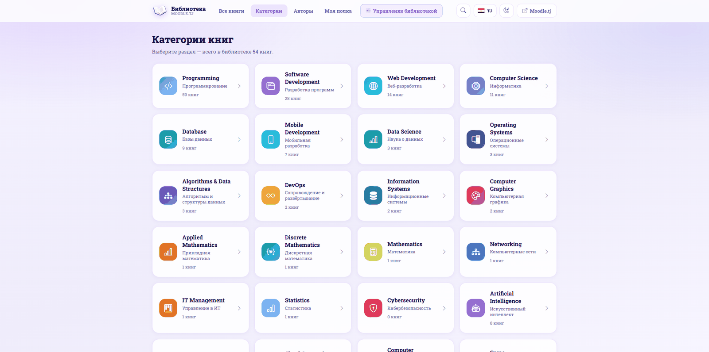
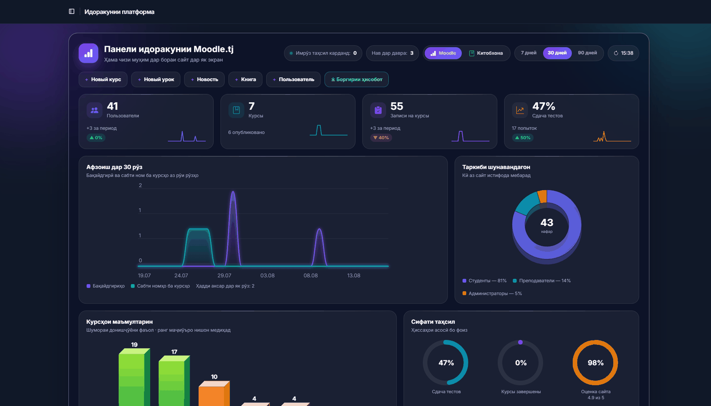
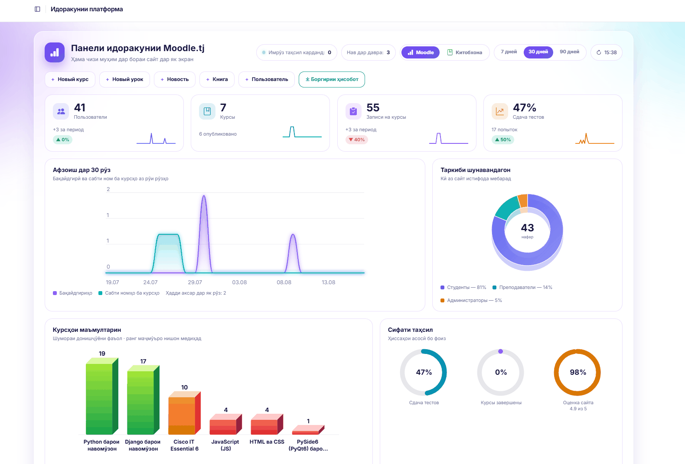
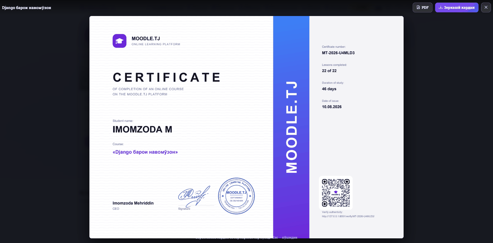
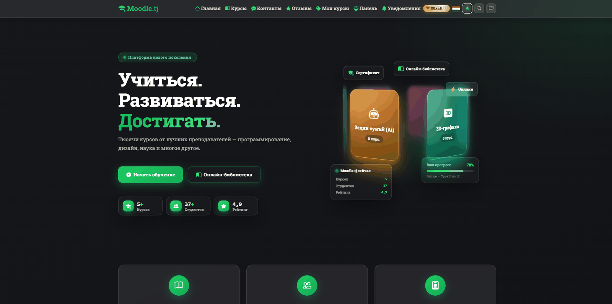

 

# Moodle.tj

### Образовательная платформа для Таджикистана

Курсы и уроки, тесты и задания, встроенный компилятор кода,
автопроверяемые задачи по программированию, ИИ-помощник, форум,
онлайн-библиотека и аналитика удержания студентов — в одной системе.

 

 

**[Сайт](https://moodle.tj/) · [Скриншоты](#скриншоты) · [Возможности](#возможности) · [Технологии](#технологии) · [Заказать проект](#заказать-проект)**

---

## Проект работает в продакшене

> Платформа запущена и обслуживает реальных студентов:
> **[moodle.tj](https://moodle.tj/)**
>
> Это не макет и не учебный пример — на площадке идут курсы,
> студенты решают задачи и получают уведомления.

| Параметр | Значение |
|---|---|
| Адрес | [moodle.tj](https://moodle.tj/) |
| Тип | LMS — система управления обучением |
| Интерфейс | Русский и таджикский |
| Роли | Студент, преподаватель, администратор |
| Доступ | Бесплатные и премиум-курсы |

---

## Это витрина, а не исходный код

> В этом репозитории **нет исходного кода** — только описание и скриншоты
> работающей платформы.
>
> **Moodle.tj — закрытый коммерческий проект.** Код хранится в приватном
> репозитории, не является open-source и не может быть скачан,
> скопирован или переиспользован.
>
> Страница создана, чтобы показать выполненную работу. Нужна такая же
> платформа — её можно **заказать**.

---

## Что нового

<table>
<tr><td width="34%" valign="top">

**Онлайн-библиотека**

Отдельный раздел с книгами: чтение прямо в браузере,
личная полка, оценки и отзывы, поиск по содержимому файлов.

</td><td width="33%" valign="top">

**Панель библиотеки в админке**

Переключатель `Moodle ↔ Библиотека`: у каждой части
своя аналитика, диаграммы и списки.

</td><td width="33%" valign="top">

**Обновлённая главная**

Объёмная карусель разделов, живая статистика
платформы и лента новостей на телефоне.

</td></tr>
</table>

---

## Скриншоты

<table>
<tr>
<td width="50%" valign="top">

### Главная страница

Экран приветствия с живой статистикой платформы: число курсов,
студентов и рейтинг. Тёмная тема, переключатель языка
и глобальный поиск в шапке.

</td>
<td width="50%" valign="top">

### Каталог курсов

Поиск по названию, фильтры по категории и уровню подготовки.
На карточке — категория, автор, длительность, число студентов
и стоимость.

</td>
</tr>
<tr>
<td width="50%" valign="top">

### Страница курса

Преподаватель, длительность, число студентов и уроков.
Полоса личного прогресса, программа курса с раскрывающимися уроками
и вкладки «Программа / О курсе / Форум».

</td>
<td width="50%" valign="top">

### Урок

Материал урока с форматированием и подсветкой кода. Справа —
содержание курса с прогрессом; уроки, доступные только
по премиум-подписке, помечены замком.

</td>
</tr>
<tr>
<td width="50%" valign="top">

### Встроенный компилятор

Урок и редактор кода на одном экране — не нужно ничего
устанавливать. Свои файлы сохраняются в аккаунте,
результат выполнения выводится тут же.

</td>
<td width="50%" valign="top">

### Задача по программированию

Условие, формат входных и выходных данных, примеры.
Кнопка «Запустить» проверяет на своих данных,
«Проверить» — прогоняет решение по всем тестам.

</td>
</tr>
<tr>
<td width="50%" valign="top">

### Автоматическая проверка

Решение прогоняется по набору тестов на сервере.
Урок открывается дальше только после успешной сдачи —
списать чужой ответ невозможно.

</td>
<td width="50%" valign="top">

### Аналитика и риск оттока

Кто учится, кто может бросить и как работают напоминания.
Активность по дням, средний прогресс, распределение студентов
по уровню риска и экспорт в CSV.

</td>
</tr>
<tr>
<td width="50%" valign="top">

### Кампании напоминаний

Автоматические письма тем, кто перестал заниматься.
Четыре готовых оформления письма, ограничение частоты
и «тихие часы», чтобы не спамить.

</td>
<td width="50%" valign="top">

### Предпросмотр письма

Каждый шаблон можно открыть и посмотреть целиком до отправки —
с прогрессом студента, кнопкой возврата к обучению
и ссылками на настройку уведомлений.

</td>
</tr>
<tr>
<td width="50%" valign="top">

### Онлайн-библиотека

Каталог книг с фильтрами по разделу, формату, оценке, языку и доступу.
Обложки собираются в объёмную книгу прямо на CSS, вид переключается
между сеткой и списком и запоминается в браузере.

</td>
<td width="50%" valign="top">

### Страница книги

Читать онлайн, скачать или отложить на полку. Продолжение чтения
с нужной страницы на любом устройстве, отзывы с оценками
и похожие книги из тех же разделов.

</td>
</tr>
<tr>
<td width="50%" valign="top">

### Личная полка

Избранное, начатое чтение с процентом прогресса и прочитанные книги.
Прогресс хранится на сервере, поэтому книга открывается
с того же места и на телефоне.

</td>
<td width="50%" valign="top">

### Разделы библиотеки

Больше двадцати разделов — от программирования до кибербезопасности,
с числом книг в каждом. Названия на двух языках, пустые разделы
в каталоге не показываются.

</td>
</tr>
<tr>
<td width="50%" valign="top">

### Панель управления

Две панели в одном экране: `Moodle` — курсы и студенты,
`Библиотека` — книги, читатели и оценки. Объёмные диаграммы
нарисованы на сервере обычным SVG, без единой внешней библиотеки.

</td>
<td width="50%" valign="top">

### Светлая тема панели

Тот же экран в светлом оформлении: показатели с мини-графиками,
рост по дням, состав аудитории и столбики курсов —
нажатие на столбик открывает список его студентов.

</td>
</tr>
<tr>
<td width="50%" valign="top">

### Сертификат

Выдаётся после прохождения курса: номер документа, число уроков,
срок обучения и QR-код. Подлинность проверяется на сайте
по адресу из кода — без входа в систему.

</td>
<td width="50%" valign="top">

### Тёмная тема

Всё оформление продумано в двух темах, а не перекрашено фильтром:
свои цвета теней, подсветки и градиентов. Выбор сохраняется
и работает на всех страницах, включая библиотеку.

</td>
</tr>
</table>

---

## Возможности

### Обучение

| Раздел | Что делает |
|---|---|
| Курсы | Категории, уровни сложности, бесплатные и премиум |
| Уроки | Текст, форматирование, подсветка кода, вложенные материалы |
| Прогресс | Отметка о прохождении, процент по курсу, продолжение с места остановки |
| Тесты | Вопросы с вариантами ответов, попытки, автоматический подсчёт баллов |
| Задания | Загрузка работ студентом, проверка и оценка преподавателем |
| Сертификация | Отслеживание завершения курса |

### Программирование

| Раздел | Что делает |
|---|---|
| Онлайн-компилятор | Редактор кода прямо в уроке, без установки чего-либо |
| Свои файлы | Код сохраняется в аккаунте студента и доступен с любого устройства |
| Задачи с автопроверкой | Условие, тесты, порог прохождения, баллы |
| Проверка по тестам | Решение прогоняется по всем тест-кейсам на сервере |
| Блокировка урока | Следующий урок открывается только после сдачи задачи |
| История отправок | Все попытки студента с кодом и результатом |

### Искусственный интеллект

| Раздел | Что делает |
|---|---|
| ИИ-помощник урока | Объясняет материал и отвечает на вопросы по теме урока |
| История диалога | Переписка сохраняется и доступна при возврате к уроку |
| Чат с автором | Отдельный ИИ-канал для связи с преподавателем курса |
| Выбор модели | Поддержка нескольких моделей, включая локальные |

### Онлайн-библиотека

| Раздел | Что делает |
|---|---|
| Каталог | Книги по разделам, языкам, форматам и оценкам; вид сеткой или списком |
| Чтение в браузере | Постраничная читалка PDF с миниатюрами, лупой и полным экраном |
| Личная полка | Избранное, начатое чтение и прочитанное — у каждого своё |
| Продолжение чтения | Страница запоминается на сервере: открывается там же с любого устройства |
| Оценки и отзывы | Пять звёзд и текст; средняя оценка сразу в карточке книги |
| Поиск по содержимому | Ищет не только по названию и автору, но и внутри самих файлов |
| Авторы | Алфавитный указатель и страница каждого автора |
| Книги в уроках | Книгу можно прикрепить к уроку как литературу к теме |
| Платные книги | Заявка на покупку уходит администратору в Telegram |
| Загрузка от преподавателей | Учитель добавляет свои книги, администратор их проверяет |

### Сообщество

| Раздел | Что делает |
|---|---|
| Форум курса | Обсуждения, ответы, голосование за полезные сообщения |
| Комментарии | Обсуждение под каждым уроком с лайками |
| Новости | Лента платформы с комментариями и голосованием |
| Отзывы | Оценки платформы от студентов |
| Уведомления | Внутренние оповещения о событиях курса |
| Telegram | Привязка аккаунта, вход и уведомления через бота |

### Преподавателю и администратору

| Раздел | Что делает |
|---|---|
| Кабинет преподавателя | Создание и редактирование курсов, уроков, тестов |
| Заявки на курс | Подтверждение записи и премиум-доступа |
| Проверка работ | Оценка заданий с обратной связью |
| Аналитика | Активность, прогресс, риск оттока, экспорт CSV |
| Кампании | Автописьма неактивным студентам с настройкой частоты |
| Модерация | Управление комментариями, отзывами и обращениями |

### Платформа

| Раздел | Что делает |
|---|---|
| Два языка | Полный перевод интерфейса на русский и таджикский |
| Тёмная тема | Переключение оформления |
| Глобальный поиск | По курсам, урокам и новостям |
| Безопасные ссылки | Идентификаторы в адресах зашифрованы |
| SEO | Карта сайта для поисковых систем |
| Онлайн-библиотека | Отдельный раздел со своим оформлением и мобильной вёрсткой |
| Две панели администратора | Аналитика курсов и аналитика библиотеки в одном экране |
| Сертификаты | PDF с QR-кодом и публичной проверкой подлинности |
| Адаптивность | Корректная работа на телефоне и планшете |

---

## Технологии

| Слой | Стек |
|---|---|
| Бэкенд |   |
| База данных |  |
| Интерфейс |   |
| Редактор кода |  |
| Запуск кода | Wandbox, Paiza.io — компиляция и выполнение на сервере |
| Искусственный интеллект |   |
| Мессенджер |  |
| Чтение книг |  — читалка встроена, файлы не уходят на чужие серверы |
| API |  — каталог и файлы книг для мобильного приложения |
| Локализация | Django i18n — русский и таджикский |

---

## Масштаб проекта

| Показатель | Значение |
|---|---|
| Моделей данных | 52 |
| Маршрутов | 300+ |
| Основных модулей | Курсы, тесты, задания, форум, новости, компилятор, ИИ, библиотека, аналитика |
| Языков интерфейса | 2 |

Ключевые сущности: `Course`, `Lesson`, `Material`, `Quiz`, `Question`, `Assignment`,
`Submission`, `Enrollment`, `LessonProgress`, `QuizAttempt`, `ForumDiscussion`,
`News`, `CompilerFile`, `CodingTask`, `CodingTestCase`, `CodingSubmission`,
`LessonAIChatHistory`, `Notification`, `Book`, `BookCategory`,
`ReadingProgress`, `BookReview`, `BookFavorite`, `LessonBook`.

---

## Что решает платформа

- **Обучение программированию без установки среды.** Студент открывает урок
  и пишет код прямо в браузере — компилятор и редактор встроены.
- **Честная проверка знаний.** Задачи проверяются автоматически по тестам,
  а следующий урок открывается только после сдачи.
- **Помощь, когда преподаватель офлайн.** ИИ-помощник объясняет материал
  урока круглосуточно.
- **Борьба с отсевом.** Аналитика показывает, кто вот-вот бросит учёбу,
  а кампании напоминаний возвращают студентов к занятиям.
- **Родной язык.** Полный таджикский интерфейс, а не машинный перевод.

---

## Заказать проект

Нужна образовательная платформа, корпоративный портал обучения
или система курсов для вашей школы, вуза или компании?
**Разрабатываю такие системы на заказ.**

Что могу сделать:

- платформу обучения под ваши задачи — курсы, тесты, сертификаты;
- автопроверку заданий по программированию с тестами;
- встроенного ИИ-помощника и чат-бота;
- интеграцию с Telegram, оплатой и вашими сервисами;
- аналитику и систему удержания студентов;
- мультиязычный интерфейс и фирменный дизайн;
- установку на ваш сервер и домен, обучение персонала, поддержку.

**Связь для заказа:**

| | |
|---|---|
| Email | **imomzoda0044@gmail.com** |
| GitHub | [@imomzoda-dev](https://github.com/imomzoda-dev) |
| Сайт | [moodle.tj](https://moodle.tj/) |

Напишите — обсудим задачу, сроки и стоимость. Консультация бесплатная.

---

## Лицензия

© 2026 Imomzoda Mehriddin. Все права защищены.

Проприетарное программное обеспечение. Копирование, распространение,
изменение и коммерческое использование без письменного разрешения
правообладателя запрещены. Скриншоты и текст этой страницы также
защищены авторским правом.

### Посмотреть платформу в работе

